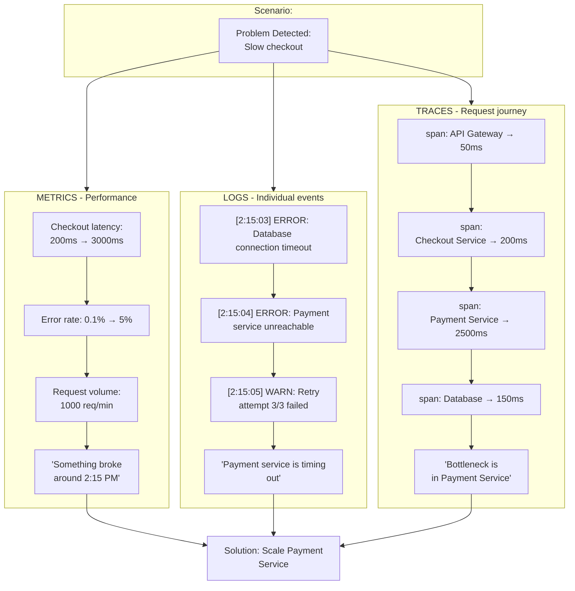

Modern software systems have outgrown the world they were originally monitored in. They're no longer simple groups of services running on predictable servers. They're complex, distributed ecosystems: microservices chained through queues, APIs, serverless functions, managed databases, and third-party platforms. The systems are massive. The complexity is unavoidable. And the idea that anyone could "hold the entire system in their head" is pretty unrealistic.

This complexity created a problem: teams need to understand what's happening inside their systems without directly observing them. That's observability.

Observability isn't just a collection of dashboards. It's a property of a system: how well its external signals reflect what's actually happening inside. When observability is strong, you can trace behavior across dozens of services and understand why something's failing. When it's weak, even simple incidents turn into detective work.

And observability, at its core, completely depends on telemetry.

Telemetry is the set of signals a system emits about itself. It describes what the system's doing, how requests move, where errors happen, how performance shifts, and how resources behave. Much like pilots depend on instrumentation to understand an aircraft mid-flight, engineering teams depend on software telemetry to understand systems they can't directly inspect.

<figure className="figure">

<figcaption>How systems emit signals that enable understanding</figcaption>
</figure>

## The three pillars of telemetry

Over time, three categories of telemetry became essential: metrics, logs, and traces. Each offers a different lens on system behavior.

**Metrics** show system performance over time: latency trends, throughput, queue depth, error rates. They reveal unusual patterns and drive alerting.

**Logs** capture individual events, carrying the detailed information needed when something unusual happens.

**Traces** show how requests travel through distributed systems, pinpointing exactly where time is spent and where things break down. They are built from spans (individual operations like database queries or API calls) that chain together to reveal a request's complete journey.

<figure className="figure">

<figcaption>How metrics, logs, and traces work together to diagnose a performance issue</figcaption>
</figure>

Together, these signals create a clear picture of system behavior. But historically, they have been difficult to manage.

Telemetry became deeply fragmented as vendors created incompatible agents and teams designed inconsistent conventions. Traces often lost context, logs exploded in volume, and metric cardinality spiraled out of control. Imagine sorting mail: by country, you'd have maybe 10 boxes, but by individual house number, you'd have millions. Teams made the same mistake with metrics, adding unique identifiers like user IDs or request IDs and accidentally creating millions of separate time series that each had to be stored, indexed, and queried. Systems buckled, costs exploded, and instead of clarity, many teams found themselves drowning in noise.

The industry needed a standard: not just for collecting telemetry, but for structuring it, transmitting it, and correlating it.

## OpenTelemetry: standardising observability

That standard became [OpenTelemetry](https://opentelemetry.io/).

OpenTelemetry didn't reinvent telemetry. It standardised it. It defined consistent APIs, shared SDKs, [semantic conventions](https://opentelemetry.io/docs/concepts/semantic-conventions/), and a universal protocol that all vendors could support. For the first time, telemetry could be generated once and consumed anywhere. Born from a merger of [OpenCensus](https://opencensus.io/) (Google) and [OpenTracing](https://opentracing.io/) in 2019, and now a [Cloud Native Computing Foundation](https://www.cncf.io/) (CNCF) project, OpenTelemetry comes from the same foundation that brought us [Kubernetes](https://kubernetes.io/) and [Prometheus](https://prometheus.io/).

This shift dramatically simplified how teams approached instrumentation. Instead of embedding vendor-specific logic inside application code, developers instrument with OpenTelemetry libraries. That instrumentation produces structured, portable telemetry that can be routed to any backend.

<figure className="figure">

<figcaption>OpenTelemetry architecture showing how application code is instrumented with the SDK, generates telemetry signals, sends them via OTLP protocol to the Collector, which then exports to observability backends</figcaption>
</figure>

## The Collector: telemetry's control plane

The most transformative part of OpenTelemetry is the [Collector](https://opentelemetry.io/docs/collector/): a vendor-neutral service that sits between your applications and your observability tools. The collector receives signals in multiple formats, processes them, adds context, filters them, batches them, applies [sampling](https://opentelemetry.io/docs/concepts/sampling/), and exports them to wherever you need them.

Think of it as a central routing hub for all your telemetry data. It acts as the "control plane" that makes intelligent decisions about your telemetry (what to keep, what to sample, where to send it) while your applications focus on the "data plane" work of actually generating those signals. This separation mirrors how network infrastructure works, and it's just as powerful here.

This separation of concerns changes everything. Instead of tying your telemetry strategy to a specific vendor, you separate data collection from analysis. Instead of pushing consistency responsibilities into application code, you centralise them in the collector. Instead of shipping data blindly to expensive tools, you shape and control it before it leaves your infrastructure.

Teams deploy collectors in several ways: as [agents](https://opentelemetry.io/docs/collector/deployment/agent/) running alongside workloads, as [centralised gateways](https://opentelemetry.io/docs/collector/deployment/gateway/), or as sidecars for isolated environments. Each model has different trade-offs, but the goal's always the same: create a resilient, scalable path for telemetry to flow, even during system stress.

<figure className="figure">

<figcaption>*OpenTelemetry Collector receiving telemetry data from applications and exporting to multiple observability backends*</figcaption>
</figure>

## Telemetry as architecture

Treating telemetry as an architectural layer (not an afterthought) has become essential. Mature teams enforce consistent naming conventions, validate instrumentation before rollout, and watch cardinality the way they watch cost. They monitor the collector itself, make sure trace context flows correctly across every service boundary, and use telemetry intentionally rather than accidentally.

When telemetry is handled this way, everything improves. Incident investigations speed up, distributed systems become understandable, and performance bottlenecks show themselves. Bug detection becomes proactive instead of reactive, teams trust the signals they see instead of second-guessing them, and observability costs stay stable because the pipeline filters and optimises signals before they hit expensive storage systems.

OpenTelemetry doesn't replace observability platforms. It empowers them. It gives teams the freedom to integrate [Grafana](https://grafana.com/), [Prometheus](https://prometheus.io/), [Tempo](https://grafana.com/oss/tempo/), [Jaeger](https://www.jaegertracing.io/), [Elasticsearch](https://www.elastic.co/), [Datadog](https://www.datadoghq.com/), [New Relic](https://newrelic.com/), [Honeycomb](https://www.honeycomb.io/), or any other tool (without rewriting their instrumentation each time). Telemetry becomes portable, vendor-agnostic, and future-proof.

## Common pitfalls and best practices

That said, OpenTelemetry isn't a magic fix. You can still shoot yourself in the foot with bad practices. One of the most common pitfalls is high-cardinality metrics. Remember that mail-sorting analogy? This is where teams accidentally choose "individual house number" instead of "country." Tracking request counts by HTTP status code creates a handful of data points, but adding unique user IDs or request IDs to every metric creates millions of separate time series. Each one must be stored, updated, and queried, which quickly becomes unmanageable.

Other challenges persist as well. Over-instrumentation floods your system with too much telemetry, making it harder to find signal in the noise. Context propagation can break when trace IDs don't flow correctly across service boundaries, leaving you with disconnected spans that tell incomplete stories. Collector pipelines can get overly complex when teams add too many processors or exotic routing rules, turning what should be simple data flow into a debugging nightmare. OpenTelemetry provides the tools, but you still need to use them thoughtfully.

## Beyond the three pillars

Beyond addressing these pitfalls, several emerging technologies are expanding what's possible with observability. [eBPF](https://ebpf.io/) enables instrumentation straight from the operating system kernel, capturing telemetry without requiring code changes or library imports, eliminating the overhead and maintenance burden of traditional instrumentation while providing deeper visibility into system behavior. Profiling, which captures where code spends CPU time and memory at the function level (like you can see in [Grafana's Pyroscope](https://grafana.com/docs/pyroscope/latest/introduction/profiling/)), is rapidly gaining ground as a fourth observability signal. AI-driven anomaly detection is emerging in production tools. Auto-instrumentation continues to advance, reducing the need for manual work.

OpenTelemetry is positioning itself at the center of this evolution, becoming the industry's unified signal language.

## Wrapping up

Observability is no longer optional. Telemetry is the foundation that makes it possible. And OpenTelemetry is the standard that's turning chaos into clarity. Teams that invest in this foundation build systems they can understand. Teams that ignore it build systems they can only hope to understand.

In distributed systems, clarity isn't just a technical advantage. It's an operational one: being able to quickly respond to changing conditions, understanding and resolving root causes fast, and keeping systems running smoothly when problems inevitably happen. And in the world we operate in now, that advantage is everything.
